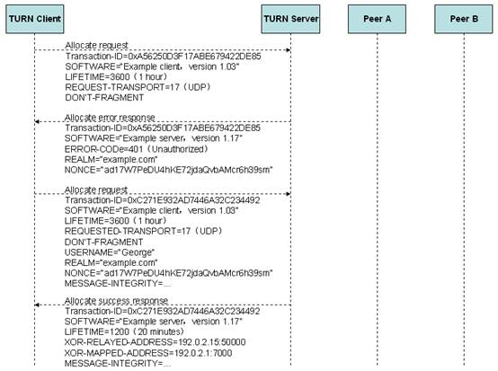

P2P平台 TURN服务器用量上报方案
============================

####鉴权流程

turn服务器的协议详细分析可以参见:	
[STUN和TURN技术浅析](http://www.h3c.com.cn/MiniSite/Technology_Circle/Net_Reptile/The_Five/Home/Catalog/201206/747038_97665_0.htm)

交互过程如下图所示:

用户要使用Turn服务器需要鉴权,我们使用用户等率平台的用户名和密码进行鉴权,这样用户在使用turn服务器时就TURN服务器可以获取平台用户的信息.

stun协议中对密码的传输使用 "username:realm:password" | md5sum" 这样的一个md5串,故平台中对于用户密码的存储也应保存为这样的一个串.

**平台提供获取用户密码的能力,平台提供获取realm的能力.**

turn服务器启动时向平台请求realm,并保存下来.若请求失败则turn服务器启动失败.

turn服务器在收到客户端发过来的*鉴权*请求时,向平台请求响应用户的密码,并进行比对,返回客户值.

####用量上报流程

若用户使用P2P连接失败,会使用turn服务器转发终端数据,turn服务器记录本次用户接收的数据量,用户发送数据的起止时间,用户连接turn服务器的ip.当用户请求结束后,这个通道将关闭,turn服务器将这些数据发送到日志服务器.

日志服务器收到这些数据,对这些数据进行持久化操作,提供查询和报表输出功能.

管理员可以通过日志服务器查询到用户一段时间内使用turn服务器的次数,使用的长度,使用的数据量,使用时的网络信息.

